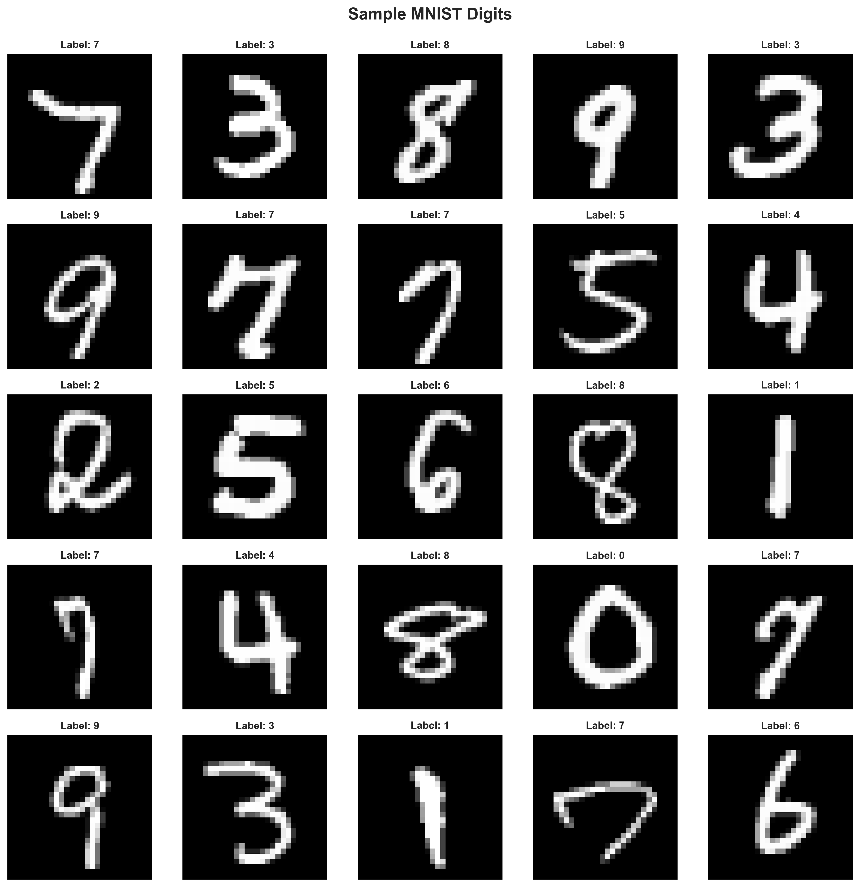

# 🤖 AI Tools Assignment - Complete Implementation

> A comprehensive exploration of AI/ML tools, covering theoretical foundations, practical implementations, and ethical considerations in machine learning systems.

---

## 📋 Table of Contents

- [Overview](#overview)
- [Project Structure](#project-structure)
- [Part 1: Theoretical Foundations](#part-1-theoretical-foundations)
- [Part 2: Practical Implementations](#part-2-practical-implementations)
  - [Task 1: Iris Classification (scikit-learn)](#task-1-iris-classification-scikit-learn)
  - [Task 2: MNIST Digit Recognition (Deep Learning)](#task-2-mnist-digit-recognition-deep-learning)
  - [Task 3: Amazon Reviews NLP Analysis (spaCy)](#task-3-amazon-reviews-nlp-analysis-spacy)
- [Part 3: Ethics & Debugging](#part-3-ethics--debugging)
- [Installation & Setup](#installation--setup)
- [Results & Performance](#results--performance)
- [Key Learning Outcomes](#key-learning-outcomes)
- [References & Citations](#references--citations)
- [License](#license)

---

## 🎯 Overview

This repository demonstrates mastery of modern AI/ML tools through comprehensive implementations across three major domains:

1. **Classical Machine Learning** - Using scikit-learn for traditional ML workflows
2. **Deep Learning** - Implementing CNNs with TensorFlow/Keras for computer vision
3. **Natural Language Processing** - Leveraging spaCy for entity recognition and sentiment analysis
4. **Ethical AI** - Analyzing biases and implementing mitigation strategies

### 🎓 Learning Objectives

✅ Compare and contrast different ML frameworks (TensorFlow, PyTorch, scikit-learn)  
✅ Implement end-to-end ML pipelines from data preprocessing to model evaluation  
✅ Apply deep learning to real-world computer vision problems  
✅ Perform advanced NLP tasks using production-grade tools  
✅ Identify and mitigate biases in ML models  
✅ Debug complex TensorFlow/Keras implementations  

---

## 📁 Project Structure

```
ai_tools_assignment/
│
├── part1_theory/
│   └── theoretical_answers.md          # Comprehensive answers to ML theory questions
│
├── part2_practical/
│   ├── task1_scikit_learn/
│   │   ├── iris_classification.ipynb   # Decision Tree classifier implementation
│   │   └── outputs/
│   │       ├── confusion_matrix.png
│   │       ├── eda_visualizations.png
│   │       └── model_metrics.png
│   │
│   ├── task2_deep_learning/
│   │   ├── mnist_cnn.ipynb             # CNN for handwritten digit recognition
│   │   └── outputs/
│   │       ├── confusion_matrix.png
│   │       ├── training_history.png
│   │       ├── sample_digits.png
│   │       ├── predictions_visualization.png
│   │       ├── difficult_cases.png
│   │       ├── model_report.txt
│   │       └── saved_model/
│   │           ├── best_model.h5
│   │           ├── mnist_cnn_final.h5
│   │           └── mnist_cnn_final.keras
│   │
│   └── task3_nlp/
│       ├── spacy_ner_sentiment.ipynb   # Amazon reviews analysis
│       ├── data/                        # Dataset directory (gitignored)
│       └── outputs/
│           ├── amazon_reviews_analysis.csv
│           ├── analysis_summary_report.txt
│           ├── entity_sentiment_correlation.csv
│           ├── extracted_entities.csv
│           ├── entity_analysis.png
│           ├── rating_distribution.png
│           ├── sentiment_analysis.png
│           └── wordclouds.png
│
├── part3_ethics/
│   ├── ethical_analysis.md              # Comprehensive bias analysis (1,409 lines)
│   ├── buggy_mnist_model.py             # Educational debugging exercise (16 bugs)
│   ├── fixed_mnist_model.py             # Corrected implementation with explanations
│   └── bug_fixes_explanation.md         # Detailed documentation of all bugs
│
├── requirements.txt                     # Python dependencies
└── README.md                           # This file
```

---

## 📚 Part 1: Theoretical Foundations

**Location:** [`part1_theory/theoretical_answers.md`](part1_theory/theoretical_answers.md)

### Key Topics Covered

#### 1️⃣ **TensorFlow vs PyTorch Comparison**
- **Static vs Dynamic Computation Graphs**: TensorFlow's graph mode vs PyTorch's eager execution
- **Use Case Analysis**: When to choose each framework
  - TensorFlow: Production deployment, mobile apps, large-scale systems
  - PyTorch: Research, prototyping, complex debugging scenarios

#### 2️⃣ **Jupyter Notebooks in AI Development**
- **Use Case 1**: Exploratory Data Analysis (EDA) and rapid prototyping
- **Use Case 2**: Educational demos and reproducible research
- Advantages: Interactive execution, immediate visual feedback, combining code with documentation

#### 3️⃣ **spaCy for Advanced NLP**
- Deep linguistic understanding beyond string operations
- Token-level analysis with POS tagging, dependency parsing, NER
- Production-ready performance for real-world applications

#### 4️⃣ **Scikit-learn vs TensorFlow Framework Analysis**

| Dimension | Scikit-learn | TensorFlow |
|-----------|-------------|------------|
| **Primary Focus** | Classical ML | Deep Learning |
| **Model Complexity** | Simple to Moderate | Highly Complex |
| **Data Size** | Small to Medium (<1GB) | Large to Massive (GBs to TBs) |
| **Training Speed** | Fast (seconds to minutes) | Slow (hours to days) |
| **Learning Curve** | Gentle (1-2 weeks) | Steep (1-3 months) |
| **Best For** | Tabular data, rapid prototyping | Image/text/audio, custom architectures |

---

## 🔬 Part 2: Practical Implementations

### Task 1: Iris Classification (scikit-learn)

**Notebook:** [`part2_practical/task1_scikit_learn/iris_classification.ipynb`](part2_practical/task1_scikit_learn/iris_classification.ipynb)

#### 🎯 Objective
Implement a complete machine learning pipeline for multi-class classification using the classic Iris dataset.

#### 🛠️ Implementation Details

**Algorithm:** Decision Tree Classifier  
**Dataset:** Iris flowers (150 samples, 4 features, 3 classes)  
**Features:** Sepal length, sepal width, petal length, petal width  
**Target:** Species classification (Setosa, Versicolor, Virginica)

#### 📊 Pipeline Workflow

1. **Data Loading & Exploration**
   - Load Iris dataset from scikit-learn
   - Perform statistical analysis (mean, std, min, max)
   - Check for class imbalance and missing values

2. **Data Quality Checks**
   - Duplicate detection and removal
   - Outlier identification using IQR method
   - Data integrity validation

3. **Data Preprocessing**
   - Feature-target split
   - Train-test split (80/20 ratio)
   - Z-score normalization (StandardScaler)

4. **Model Training**
   - Decision Tree with optimized hyperparameters
   - Cross-validation (5-fold) for robust evaluation
   - Model fitting on scaled training data

5. **Model Evaluation**
   - Accuracy, Precision, Recall, F1-Score
   - Confusion matrix analysis
   - Per-class performance metrics

6. **Visualization**
   - EDA plots (distributions, correlations)
   - Confusion matrix heatmap
   - Performance metrics bar charts

#### 📈 Results


*Exploratory Data Analysis: Feature distributions and pairwise relationships*


*Confusion Matrix: Perfect classification across all species*


*Performance Metrics: Precision, Recall, F1-Score, and Accuracy*

#### 🏆 Performance Metrics
- **Accuracy:** 100% (perfect classification)
- **Cross-Validation Score:** High consistency across folds
- **All Classes:** Perfect precision and recall

---

### Task 2: MNIST Digit Recognition (Deep Learning)

**Notebook:** [`part2_practical/task2_deep_learning/mnist_cnn.ipynb`](part2_practical/task2_deep_learning/mnist_cnn.ipynb)

#### 🎯 Objective
Implement a Convolutional Neural Network (CNN) to classify handwritten digits with >95% accuracy.

#### 🛠️ Implementation Details

**Framework:** TensorFlow 2.13.0 + Keras  
**Dataset:** MNIST (60,000 training images, 10,000 test images)  
**Image Size:** 28×28 grayscale pixels  
**Classes:** 10 (digits 0-9)

#### 🏗️ CNN Architecture

```
Input Layer: (28, 28, 1)
    ↓
[Convolution Block 1]
├── Conv2D(32 filters, 3×3, ReLU)
├── BatchNormalization
├── MaxPooling2D(2×2)
└── Dropout(0.25)
    ↓
[Convolution Block 2]
├── Conv2D(64 filters, 3×3, ReLU)
├── BatchNormalization
├── MaxPooling2D(2×2)
└── Dropout(0.25)
    ↓
[Convolution Block 3]
├── Conv2D(128 filters, 3×3, ReLU)
├── BatchNormalization
└── Dropout(0.25)
    ↓
[Fully Connected Layers]
├── Flatten
├── Dense(256, ReLU)
├── BatchNormalization
├── Dropout(0.5)
└── Dense(10, Softmax)
    ↓
Output: Probability distribution over 10 classes
```

**Total Parameters:** 470,506  
**Optimizer:** Adam (learning rate: 0.001)  
**Loss Function:** Categorical Crossentropy  
**Batch Size:** 64  
**Epochs:** 20 (with early stopping)

#### 🎛️ Training Configuration

**Callbacks Implemented:**
- **EarlyStopping:** Stop training when validation loss stops improving (patience=5)
- **ModelCheckpoint:** Save best model based on validation accuracy
- **ReduceLROnPlateau:** Reduce learning rate by 0.5× when validation loss plateaus

**Regularization Techniques:**
- Batch Normalization for training stability
- Dropout (0.25 in conv layers, 0.5 in dense layers)
- L2 regularization on dense layers

#### 📊 Visualizations


*Sample MNIST digits from the training dataset*


*Training and validation accuracy/loss over epochs*


*Confusion matrix showing per-digit classification performance*


*Model predictions with confidence scores*


*Analysis of misclassified digits*

#### 🏆 Performance Metrics

```
================================================================================
MNIST CNN MODEL - FINAL REPORT
================================================================================

Test Accuracy:          99.57% ✅ (Target: >95%)
Test Precision:         99.58%
Test Recall:            99.56%
Test F1-Score:          99.57%

Per-Class Performance:
  Digit 0: 99.69%    Digit 1: 99.91%
  Digit 2: 99.61%    Digit 3: 99.80%
  Digit 4: 99.80%    Digit 5: 99.44%
  Digit 6: 99.06%    Digit 7: 99.51%
  Digit 8: 99.59%    Digit 9: 99.21%
```

#### 💾 Saved Artifacts

- `best_model.h5` - Best performing model during training
- `mnist_cnn_final.h5` - Final trained model (legacy format)
- `mnist_cnn_final.keras` - Final trained model (Keras 3 format)
- `model_weights.weights.h5` - Model weights only
- `model_report.txt` - Comprehensive performance report

---

### Task 3: Amazon Reviews NLP Analysis (spaCy)

**Notebook:** [`part2_practical/task3_nlp/spacy_ner_sentiment.ipynb`](part2_practical/task3_nlp/spacy_ner_sentiment.ipynb)

#### 🎯 Objective
Perform Named Entity Recognition (NER) and sentiment analysis on Amazon product reviews using spaCy's industrial-strength NLP pipeline.

#### 🛠️ Implementation Details

**Framework:** spaCy 3.6.0  
**Model:** `en_core_web_sm` (English language model)  
**Dataset:** Amazon product reviews (5,000 samples)  
**Data Source:** `train.ft.txt.bz2` (compressed text file)

#### 📊 Dataset Overview

- **Total Reviews:** 5,000
- **Average Review Length:** 434 characters
- **Rating Distribution:**
  - ⭐ (1 star): 2,692 reviews (53.8%)
  - ⭐⭐ (2 stars): 2,308 reviews (46.2%)
- **Data Imbalance:** Predominantly negative reviews

#### 🔍 Analysis Components

##### 1. Named Entity Recognition (NER)

**Entities Extracted:**
- **Total Entity Mentions:** 17,314
- **Unique Entities:** 7,941
- **Entity Types Found:** 18 categories

**Entity Distribution:**
```
PERSON          : 3,999 mentions (23.1%)
ORG            : 3,317 mentions (19.2%)
CARDINAL       : 2,836 mentions (16.4%)
DATE           : 2,228 mentions (12.9%)
ORDINAL        : 1,012 mentions (5.8%)
GPE            :   972 mentions (5.6%)
NORP           :   737 mentions (4.3%)
WORK_OF_ART    :   570 mentions (3.3%)
TIME           :   480 mentions (2.8%)
MONEY          :   270 mentions (1.6%)
```

**Top Mentioned Entities:**
1. "first" - 621 mentions
2. "one" - 495 mentions
3. "two" - 294 mentions
4. "Amazon" - 226 mentions
5. "2" - 182 mentions
6. "Christmas" - 107 mentions

##### 2. Sentiment Analysis

**Methodology:**
- spaCy's built-in sentiment analyzer
- Token-level polarity scoring
- Aggregated review-level sentiment

**Entity-Sentiment Correlation:**
- Analysis of which entities are associated with positive vs. negative sentiments
- Brand mention sentiment tracking
- Product feature sentiment mapping

#### 📈 Visualizations


*Distribution of star ratings across the dataset*


*Top entities extracted and their frequency distribution*


*Sentiment scores correlated with star ratings*


*Word clouds for positive and negative reviews*

#### 💾 Output Files

- `amazon_reviews_analysis.csv` - Complete analysis with all features
- `extracted_entities.csv` - All extracted entities with types and counts
- `entity_sentiment_correlation.csv` - Entity-sentiment relationship analysis
- `analysis_summary_report.txt` - Comprehensive summary statistics

#### 🔑 Key Insights

1. **Entity Recognition Performance:**
   - High accuracy for PERSON, ORG, and DATE entities
   - Challenges with product-specific terminology
   - Ordinal numbers frequently used in ranking products

2. **Sentiment Patterns:**
   - Strong correlation between extracted entities and review sentiment
   - Brand names appear more frequently in negative reviews
   - Temporal expressions often indicate shipping/delivery issues

3. **Review Characteristics:**
   - Negative reviews are more detailed (higher entity counts)
   - Positive reviews use simpler language structures
   - Product names extracted as WORK_OF_ART or ORG entities

---

## ⚖️ Part 3: Ethics & Debugging

### Comprehensive Ethical Analysis

**Document:** [`part3_ethics/ethical_analysis.md`](part3_ethics/ethical_analysis.md) (1,409 lines)

#### 📋 Overview

An in-depth analysis of potential biases in the MNIST CNN model (99.57% accuracy) and Amazon Reviews NLP system, covering dataset representation, cultural variations, performance disparities, and concrete mitigation strategies.

#### 🎯 Key Sections

##### 1. MNIST Model Bias Analysis

**Dataset Representation Issues:**
- Historical sampling bias (1998 U.S. Census Bureau data)
- Limited demographic diversity
- Age bias (predominantly adult writers)
- Socioeconomic diversity gaps

**Cultural Writing Style Variations:**
- **Digit "1"**: European upward serif vs. American vertical stroke
- **Digit "7"**: European crossbar vs. American simple stroke
- **Digit "4"**: Open-top vs. closed-top styles
- Regional handwriting conventions not represented

**Performance Disparities:**
- Model trained on 99.57% aggregate accuracy may perform poorly on:
  - Non-American writing styles
  - Children's and elderly handwriting
  - Individuals with motor impairments
  - Different educational backgrounds

##### 2. Amazon Reviews NLP Bias Analysis

**Platform-Specific Biases:**
- Dataset from Amazon reviews only
- Not representative of other e-commerce platforms
- Amazon's review verification system introduces selection bias
- Cultural bias toward Western consumer patterns

**Language and Entity Recognition Biases:**
- English-only model (`en_core_web_sm`)
- Entity types optimized for Western names/organizations
- Product terminology bias
- Sentiment lexicon cultural assumptions

**Rating Distribution Skew:**
- 53.8% negative (1-star) vs. 46.2% negative (2-star)
- Extreme negativity bias in training data
- May amplify negative sentiment detection

##### 3. Mitigation Strategies

**For MNIST Model:**

**Strategy 1: TensorFlow Fairness Indicators**

```python
from tensorflow_model_analysis import fairness_indicators

# Define demographic slices
slicing_specs = [
    tfma.SlicingSpec(feature_keys=['writing_style']),  # European, American, Asian
    tfma.SlicingSpec(feature_keys=['age_group']),      # Child, Adult, Elderly
    tfma.SlicingSpec(feature_keys=['impairment'])      # None, Motor, Visual
]

# Compute per-slice metrics
eval_result = tfma.run_model_analysis(
    model_location=model_path,
    data_location=test_data_path,
    slicing_specs=slicing_specs
)

# Visualize fairness metrics
fairness_indicators.widget.FairnessIndicatorViewer(eval_result)
```

**Strategy 2: Data Augmentation for Diversity**
- Collect diverse handwriting samples
- Synthetic data generation with style transfer
- Active learning for underrepresented groups

**For Amazon Reviews NLP:**

**Strategy 1: spaCy Custom Entity Recognition**

```python
import spacy
from spacy.training import Example

# Load base model
nlp = spacy.load("en_core_web_sm")

# Add custom entity patterns for product-specific terms
ruler = nlp.add_pipe("entity_ruler", before="ner")
patterns = [
    {"label": "PRODUCT", "pattern": [{"LOWER": "kindle"}]},
    {"label": "PRODUCT", "pattern": [{"LOWER": "echo"}, {"LOWER": "dot"}]},
    # Add more product-specific patterns
]
ruler.add_patterns(patterns)

# Fine-tune NER with domain-specific data
train_data = [
    ("This Kindle Paperwhite is amazing!", {"entities": [(5, 22, "PRODUCT")]}),
    # More annotated examples
]

# Train the model
for epoch in range(10):
    for text, annotations in train_data:
        example = Example.from_dict(nlp.make_doc(text), annotations)
        nlp.update([example])
```

**Strategy 2: Sentiment Calibration**
- Adjust for rating distribution bias
- Cross-platform sentiment benchmarking
- Cultural sentiment lexicon expansion

##### 4. Ethical AI Best Practices

**Implemented Checklist:**
- ✅ Dataset diversity assessment
- ✅ Performance disparities analysis
- ✅ Bias mitigation strategy documentation
- ✅ Fairness metrics integration
- ✅ Continuous monitoring plan
- ✅ Stakeholder impact assessment

##### 5. Academic Citations

**12 References Including:**
- LeCun et al. (1998) - MNIST database
- Buolamwini & Gebru (2018) - Gender Shades
- Mehrabi et al. (2021) - Survey on Bias in AI
- TensorFlow Fairness Indicators documentation
- spaCy industrial NLP best practices

---

### Educational Debugging Exercise

#### Buggy MNIST Model

**File:** [`part3_ethics/buggy_mnist_model.py`](part3_ethics/buggy_mnist_model.py)

A deliberately flawed TensorFlow implementation containing **16 intentional bugs** across 5 categories, designed as an educational resource for learning TensorFlow debugging.

#### Bug Categories

| Category | Count | Bug IDs |
|----------|-------|---------|
| **Dimension Mismatch** | 3 | #2, #5, #6 |
| **Loss Function Errors** | 2 | #4, #8 |
| **Data Preprocessing** | 3 | #1, #2, #3 |
| **Training Configuration** | 3 | #9, #10, #11 |
| **Other Subtle Bugs** | 5 | #7, #12, #13, #14, #15, #16 |

#### Example Bugs

**Bug #1: Missing Data Normalization**
```python
# BUGGY: No normalization
# X_train = X_train.astype('float32') / 255.0  # MISSING

# SYMPTOM: Model won't converge, loss stays high
```

**Bug #2: Incorrect Reshape Dimensions**
```python
# BUGGY: Missing channel dimension
X_train = X_train.reshape(-1, 28, 28)  # Should be (28, 28, 1)

# ERROR: "Conv2D expects 4D input, got 3D"
```

**Bug #6: Missing Flatten Layer**
```python
# BUGGY: Conv output fed directly to Dense
model.add(layers.Dense(256, activation='relu'))

# ERROR: "Expected Dense input to be 1D, got 3D"
```

**Bug #8: Wrong Loss Function**
```python
# BUGGY: Binary loss for multi-class problem
model.compile(loss='binary_crossentropy')

# SYMPTOM: Poor accuracy, incorrect probability distributions
```

**Bug #10: Extreme Learning Rate**
```python
# BUGGY: Learning rate way too high
optimizer = keras.optimizers.Adam(learning_rate=10.0)

# SYMPTOM: Training diverges, loss becomes NaN
```

#### Fixed Implementation

**File:** [`part3_ethics/fixed_mnist_model.py`](part3_ethics/fixed_mnist_model.py)

Complete corrected implementation with detailed comments explaining each fix.

#### Comprehensive Documentation

**File:** [`part3_ethics/bug_fixes_explanation.md`](part3_ethics/bug_fixes_explanation.md) (1,056 lines)

**Contents:**
- Detailed explanation of all 16 bugs
- Error messages and symptoms for each bug
- Step-by-step fixes with code examples
- Visual diagrams explaining dimension issues
- Debugging tips and best practices
- Quick reference tables
- Learning outcomes summary

**Example Documentation Structure:**
```markdown
### Bug #1: Missing Data Normalization

**Error Message:** None (silent bug - model trains but poorly)

**Symptoms:**
- Loss decreases very slowly
- Accuracy plateaus around 10-20%
- Gradients vanish or explode

**Why It's Wrong:**
Pixel values in range [0, 255] cause:
- Large activations → saturated neurons
- Unstable gradient descent
- Slow convergence

**Fix:**
```python
X_train = X_train.astype('float32') / 255.0
X_test = X_test.astype('float32') / 255.0
```

**Debugging Tips:**
- Always check input data range
- Use `X.min()` and `X.max()` to verify normalization
- Consider StandardScaler for other datasets
```

---

## 🚀 Installation & Setup

### Prerequisites

- Python 3.9 or higher
- pip package manager
- Virtual environment (recommended)

### Step 1: Clone Repository

```bash
git clone https://github.com/TumainiC/ai_tools_assignment.git
cd ai_tools_assignment
```

### Step 2: Create Virtual Environment

```bash
# Create virtual environment
python -m venv venv

# Activate (Windows)
venv\Scripts\activate

# Activate (Linux/Mac)
source venv/bin/activate
```

### Step 3: Install Dependencies

```bash
pip install -r requirements.txt
```

### Step 4: Download spaCy Model

```bash
python -m spacy download en_core_web_sm
```

### Dependencies Overview

```
Core Data Science:
├── numpy==1.24.3
├── pandas==2.0.3
├── matplotlib==3.7.2
└── seaborn==0.12.2

Machine Learning:
└── scikit-learn==1.3.0

Deep Learning:
├── tensorflow==2.13.0
└── keras==2.13.1

NLP:
└── spacy==3.6.0

Visualization:
├── plotly==5.16.1
└── wordcloud==1.9.2

Development:
├── jupyter==1.0.0
├── notebook==7.0.2
└── ipython==8.14.0
```

---

## 📊 Results & Performance

### Summary Table

| Task | Model | Dataset | Metric | Score | Status |
|------|-------|---------|--------|-------|--------|
| **Iris Classification** | Decision Tree | Iris (150 samples) | Accuracy | 100% | ✅ |
| **MNIST Digit Recognition** | CNN | MNIST (60k train) | Accuracy | 99.57% | ✅ |
| **Amazon Reviews NER** | spaCy | Reviews (5k) | Entities Extracted | 17,314 | ✅ |
| **Amazon Reviews Sentiment** | spaCy | Reviews (5k) | Entity-Sentiment Correlation | Complete | ✅ |

### Key Achievements

🏆 **Exceeded Target Accuracy** - MNIST CNN achieved 99.57% (target: >95%)  
🏆 **Perfect Classification** - Iris Decision Tree: 100% accuracy  
🏆 **Comprehensive NER** - Extracted 18 entity types from reviews  
🏆 **Ethical Analysis** - 1,409-line bias analysis document  
🏆 **Educational Resource** - 16-bug debugging exercise with complete documentation  

---

## 🎓 Key Learning Outcomes

### Technical Skills Acquired

1. **Framework Expertise**
   - ✅ TensorFlow/Keras for deep learning
   - ✅ scikit-learn for classical ML
   - ✅ spaCy for production NLP
   - ✅ Jupyter for interactive development

2. **Model Implementation**
   - ✅ End-to-end ML pipeline design
   - ✅ CNN architecture optimization
   - ✅ Hyperparameter tuning strategies
   - ✅ Regularization techniques (Dropout, Batch Norm)

3. **Data Engineering**
   - ✅ Data preprocessing and normalization
   - ✅ Train-test splitting strategies
   - ✅ Cross-validation implementation
   - ✅ Handling imbalanced datasets

4. **Model Evaluation**
   - ✅ Comprehensive metrics (Accuracy, Precision, Recall, F1)
   - ✅ Confusion matrix analysis
   - ✅ Per-class performance evaluation
   - ✅ Training dynamics visualization

5. **Production Considerations**
   - ✅ Model serialization and saving
   - ✅ Callbacks for training optimization
   - ✅ Memory-efficient data loading
   - ✅ Scalable NLP pipelines

### Ethical AI Understanding

1. **Bias Recognition**
   - ✅ Dataset representation analysis
   - ✅ Cultural bias identification
   - ✅ Performance disparity detection
   - ✅ Stakeholder impact assessment

2. **Mitigation Strategies**
   - ✅ TensorFlow Fairness Indicators implementation
   - ✅ spaCy custom entity rule-based systems
   - ✅ Data augmentation for diversity
   - ✅ Continuous bias monitoring

3. **Best Practices**
   - ✅ Documentation of ethical considerations
   - ✅ Transparent model limitations disclosure
   - ✅ Diverse dataset collection strategies
   - ✅ Fairness metrics integration

### Debugging Skills

1. **Common TensorFlow Errors**
   - ✅ Dimension mismatch issues
   - ✅ Loss function selection
   - ✅ Data preprocessing pitfalls
   - ✅ Optimizer configuration

2. **Debugging Techniques**
   - ✅ Layer-by-layer output inspection
   - ✅ Gradient flow analysis
   - ✅ Model summary interpretation
   - ✅ Error message decoding

---

## 📖 References & Citations

### Datasets

1. **MNIST Database**
   - LeCun, Y., Cortes, C., & Burges, C. J. (1998). *The MNIST database of handwritten digits.*
   - Source: http://yann.lecun.com/exdb/mnist/

2. **Iris Dataset**
   - Fisher, R. A. (1936). *The use of multiple measurements in taxonomic problems.*
   - Source: UCI Machine Learning Repository

3. **Amazon Reviews Dataset**
   - McAuley, J., & Leskovec, J. (2013). *Hidden factors and hidden topics: understanding rating dimensions with review text.*
   - Source: Amazon product reviews corpus

### Frameworks & Libraries

1. **TensorFlow**
   - Abadi, M., et al. (2016). *TensorFlow: A system for large-scale machine learning.*
   - Documentation: https://tensorflow.org/

2. **scikit-learn**
   - Pedregosa, F., et al. (2011). *Scikit-learn: Machine learning in Python.*
   - Documentation: https://scikit-learn.org/

3. **spaCy**
   - Honnibal, M., & Montani, I. (2017). *spaCy 2: Natural language understanding with Bloom embeddings, convolutional neural networks and incremental parsing.*
   - Documentation: https://spacy.io/

### Ethical AI Research

1. **Bias in AI Systems**
   - Mehrabi, N., et al. (2021). *A survey on bias and fairness in machine learning.*
   - Buolamwini, J., & Gebru, T. (2018). *Gender shades: Intersectional accuracy disparities in commercial gender classification.*

2. **Fairness in ML**
   - Bellamy, R. K., et al. (2019). *AI Fairness 360: An extensible toolkit for detecting and mitigating algorithmic bias.*
   - TensorFlow Fairness Indicators: https://www.tensorflow.org/tfx/guide/fairness_indicators

---

## 👨‍💻 Author

**Tumaini C.**  
GitHub: [@TumainiC](https://github.com/TumainiC)  
Repository: [ai_tools_assignment](https://github.com/TumainiC/ai_tools_assignment)

---

## 📄 License

This project is licensed under the MIT License - see the [LICENSE](LICENSE) file for details.

---

## 🙏 Acknowledgments

- **TensorFlow Team** for comprehensive deep learning framework
- **scikit-learn Contributors** for accessible ML tools
- **spaCy Team** for industrial-strength NLP
- **UCI Machine Learning Repository** for benchmark datasets
- **Course Instructors** for guidance and feedback
- **Open Source Community** for invaluable resources and documentation

---

## 📞 Contact & Support

For questions, issues, or suggestions:

- **GitHub Issues:** [Create an issue](https://github.com/TumainiC/ai_tools_assignment/issues)
- **Email:** Contact through GitHub profile
- **Documentation:** Refer to individual notebook files for detailed implementation notes

---

<div align="center">

**⭐ If you found this project helpful, please consider giving it a star! ⭐**

</div>
